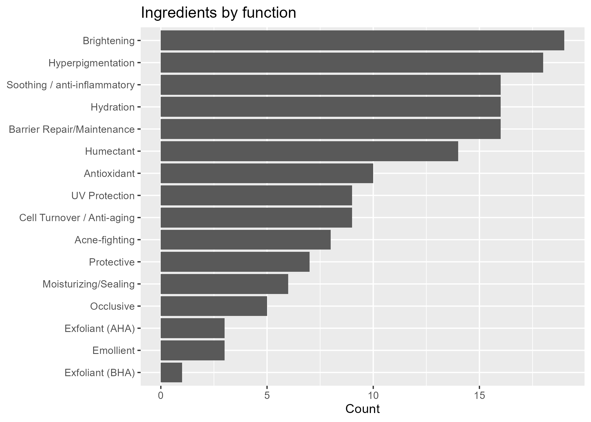

# Personal Skincare Ingredients Lookup
A list of ingredients pertaining to my dry, sensitive, and acne-prone skin type.

## Details
Each ingredient has its common name, INCI name, function(s), irritation potential, notes, and a source link.

## Purpose
I choose products by ingredients rather than brand, so I built this to check what an ingredient does and how likely it is to irritate my skin before buying.

## Files
- [ingredients.csv](ingredients.csv)
- [ingredient_lookup](ingredient_lookup.R`) — search function + summary chart

## Tools used
R (tidyverse, ggplot2), Notion
